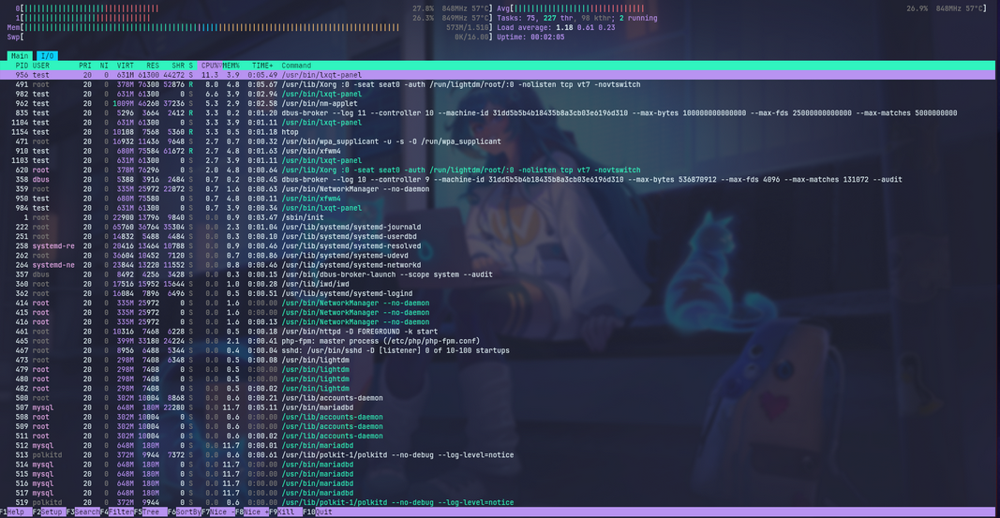
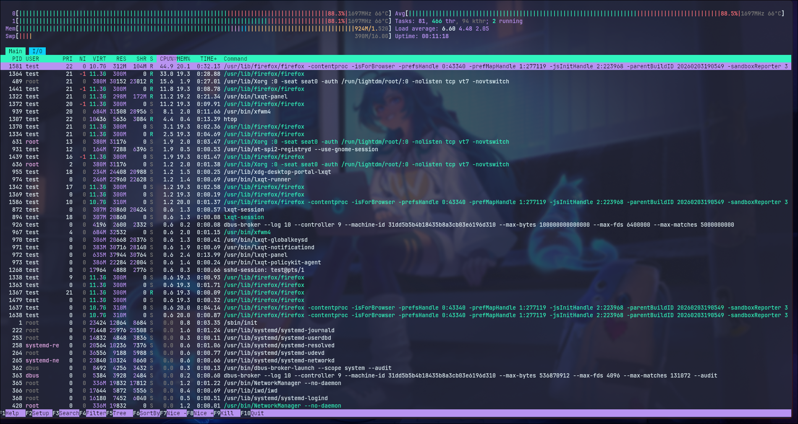
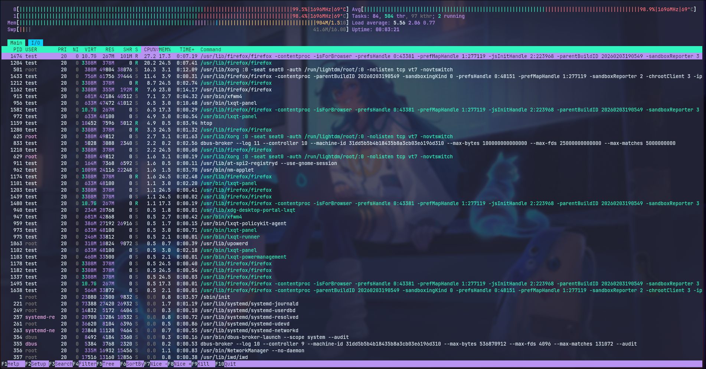
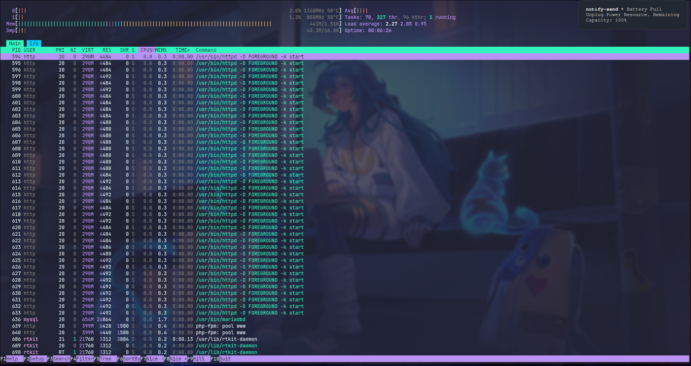
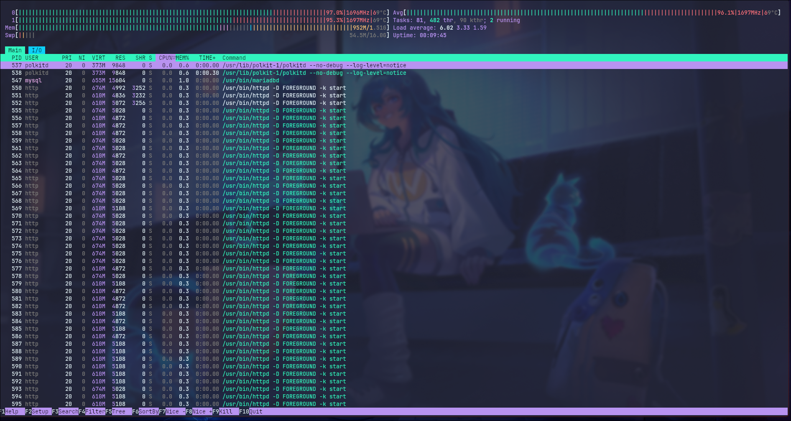

# Laporan Hasil Research

## Background

Quinton merpukana riset yang bertujuan untuk pengembangan sistem operasi bagi lembaga GLAM (Gallery, Library, Archives, and Museums). Riset ini bertujuan untuk mencari kernel dan desktop environment yang cocok digunakan bagi perangkat dengan spesifikasi rendah dan waktu produksi yang telah lebih dari 10 tahun. Cakupan penelitian yang mengambil dengan batasan spesifikasi rendah yang telah lebih dari 10 tahun karena tingginya utilitas penggunaan perangkat yang menggunakan spesifikasi rendah dan umur produksi yang lebih dari 10 tahun di perpustakaan. Data tersebut didapatkan dari hasil riset yang bekerja sama dengan HMPS Ilmu Perpustakaan UIN Syarif Hidayatullah Jakarta dari beberapa sampel yang dikumpulkan dari berbagai instansi yang ada di Jakarta.  

## Spesification

Untuk riset ini kami menggunakan perangkat laptop dengan spesifikasi sebagai berikut

| Jenis   | Spesifikasi                                                |
| ------- | --------------------------------------------------------- |
| RAM     | 2 GB DDR3 PC-10600                                        |
| CPU     | AMD E2-1800/E-350 APU (1.0 GHz, 1MB Cache)                |
| Storage | n/a                                                       |
| Grafis   | AMD Radeon HD 7340                                        |
| Layar   | 14 inci, resolusi 1366 x 768 piksel, LED Backlight (16:9) |

Adapun aplikasi yang kami gunakan untuk membantu melakukan riset sebagai berikut

| Aplikasi | Versi                   |
| -------- | ----------------------- |
| SLiMS    | 9.7.2 (Bulian D Roger)  |
| Htop     | 3.4.1                   |

## Methods

### Pengumpulan Data

1. Mengumpulkan informasi melalui kerjasama dengan organisasi terkait untuk pengumpulan spesifikasi komputer
2. Pengolahan data spesifikasi komputer untuk mendapatkan gambaran umum terkait spesifikasi komputer yang digunakan di perpustakaan
3. Mengumpulkan informasi-informasi kernel yang memungkinkan untuk bisa berjalan secara optimal pada spesifikasi komputer yang didapat
4. Mengumpulkan informasi-informasi desktop environment yang memungkinkan untuk bisa berjalan secara optimal pada spesifikasi komputer yang didapat
5. Mengumpulkan informasi-informasi browser yang memungkinkan untuk bisa berjalan secara optimal pada spesifikasi komputer yang didapat

### Pelaksanaan Eksperimen

1. Melakukan instalasi kernel yang berpotensi kepada sistem uji coba
2. Melakukan instalasi desktop environment yang berpotensi kepada sistem uji coba
3. Melakukan instalasai aplikasi untuk mendukung hasil penelitian
4. Melakukan benchmarking dan pencatatan hasil benchmarking terhadap setiap kernel dan desktop environment
5. Menerapkan sistem ranking untuk menetapkan candidate terbaik

## Result

### Kernel

1. kernel vfio

| Kernel | CPU Idle | RAM Idle | CPU Pemakaian | RAM Pemakaian | Load Firefox |
| ------ | -------- | -------- | ------------- | ------------- | ------------ |
| vfio    | 26,9%    | 354M     | 66,2–87,3%    | 1,4G          | 37 detik     |

> Berikut hasil testing kernel pada saat tidak menjalankan aplikasi

> Di atas adalah hasil testing ketika membuka aplikasi youtube dan slims

2. kernel git

| Kernel | CPU Idle | RAM Idle | CPU Pemakaian | RAM Pemakaian | Load Firefox |
| ------ | -------- | -------- | ------------- | ------------- | ------------ |
| git    | 1-2,6%    | 576M     | 66,2–99,1%    | 1,08G         | 13 detik     |

> Berikut hasil testing kernel pada saat tidak menjalankan aplikasi

> Di atas adalah hasil testing ketika membuka aplikasi youtube dan slims

3. kernel lqx

| Kernel | CPU Idle | RAM Idle | CPU Pemakaian | RAM Pemakaian | Load Firefox |
| ------ | -------- | -------- | ------------- | ------------- | ------------ |
| lqx    | 1,9%     | 661M     | 36-89%        | 1,23G         | 30 detik     |

> Berikut hasil testing kernel pada saat tidak menjalankan aplikasi

> Di atas adalah hasil testing ketika membuka aplikasi youtube dan slims

4. kernel lts61

| Kernel | CPU Idle | RAM Idle | CPU Pemakaian | RAM Pemakaian | Load Firefox |
| ------ | -------- | -------- | ------------- | ------------- | ------------ |
| lts61  | 2,2-3,8% | 600M     | 24-94%        | 1,21G         | 22 detik     |

> Berikut hasil testing kernel pada saat tidak menjalankan aplikasi

> Di atas adalah hasil testing ketika membuka aplikasi youtube dan slims

5. kernel lts66

| Kernel | CPU Idle | RAM Idle | CPU Pemakaian | RAM Pemakaian | Load Firefox |
| ------ | -------- | -------- | ------------- | ------------- | ------------ |
| lts66  | 1,9%     | 630M     | 39,8-96%      | 1,11G         | 24 detik     |

> Berikut hasil testing kernel pada saat tidak menjalankan aplikasi

> Di atas adalah hasil testing ketika membuka aplikasi youtube dan slims

6. kernel mainline

| Kernel   | CPU Idle | RAM Idle | CPU Pemakaian | RAM Pemakaian | Load Firefox |
| ------   | -------- | -------- | ------------- | ------------- | ------------ |
| mainline | 1,9%     | 360M     | 36-86%        | 971G          | 35 detik     |

> Berikut hasil testing kernel pada saat tidak menjalankan aplikasi

> Di atas adalah hasil testing ketika membuka aplikasi youtube dan slims

7. kernel rt

| Kernel | CPU Idle | RAM Idle | CPU Pemakaian | RAM Pemakaian | Load Firefox |
| ------ | -------- | -------- | ------------- | ------------- | ------------ |
| rt     | 5,4%     | 538M     | 43,8%         | 1,18G         | 12 detik     |

> Berikut hasil testing kernel pada saat tidak menjalankan aplikasi

> Di atas adalah hasil testing ketika membuka aplikasi youtube dan slims

8. kernel rt-lts

| Kernel | CPU Idle | RAM Idle | CPU Pemakaian | RAM Pemakaian | Load Firefox |
| ------ | -------- | -------- | ------------- | ------------- | ------------ |
| rt-lts | 1,9%     | 435M     | 50-94%        | 1,14G         | 21 detik     |

> Berikut hasil testing kernel pada saat tidak menjalankan aplikasi

> Di atas adalah hasil testing ketika membuka aplikasi youtube dan slims

9. kernel tachyon

| Kernel | CPU Idle | RAM Idle | CPU Pemakaian | RAM Pemakaian | Load Firefox |
| ------ | -------- | -------- | ------------- | ------------- | ------------ |
| tachyon| 1,6%     | 323M     | 36,8-90,1%    | 1,4G         | 35 detik     |

> Berikut hasil testing kernel pada saat tidak menjalankan aplikasi

> Di atas adalah hasil testing ketika membuka aplikasi youtube dan slims

10. kernel vfio-lts

| Kernel | CPU Idle | RAM Idle | CPU Pemakaian | RAM Pemakaian | Load Firefox |
| ------ | -------- | -------- | ------------- | ------------- | ------------ |
| vfio-lts| 2%       | 565M     | 40-90%        | 1,03G         | 21 detik     |

> Berikut hasil testing kernel pada saat tidak menjalankan aplikasi

> Di atas adalah hasil testing ketika membuka aplikasi youtube dan slims

11. kernel zen

| Kernel | CPU Idle | RAM Idle | CPU Pemakaian | RAM Pemakaian | Load Firefox |
| ------ | -------- | -------- | ------------- | ------------- | ------------ |
| zen    | 5,4%     | 538M     | 41,7%         | 1,18G         | 12 detik     |

> Berikut hasil testing kernel pada saat tidak menjalankan aplikasi

> Di atas adalah hasil testing ketika membuka aplikasi youtube dan slims

## Conclusion

Berdasarkan hasil riset, dapat disimpulkan bahwa kernel dan desktop environment yang kami pilih berdasarkan hasil sistem ranking 
